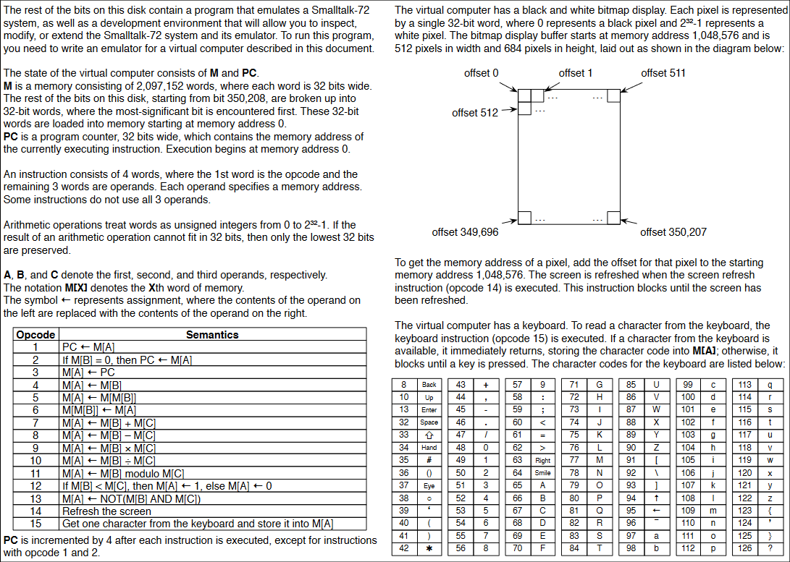

# cuneiform

This is a virtual machine implemented in Javascript. It is inspired by this paper:

> Nguyen, Long Tien, and Alan Kay. "The cuneiform tablets of 2015." 2015 ACM International Symposium on New Ideas, New Paradigms, and Reflections on Programming and Software (Onward!). 2015. https://www.vpri.org/pdf/tr2015004_cuneiform.pdf

Below is a page from the above paper explain how to implement the virtual machine.

